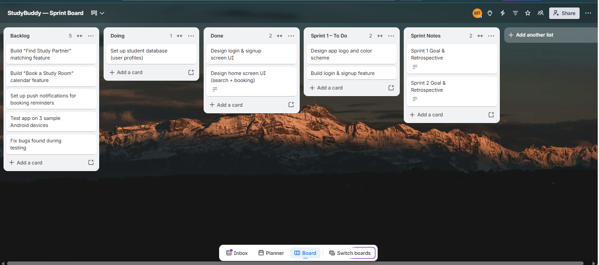
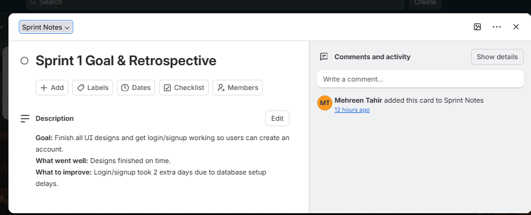
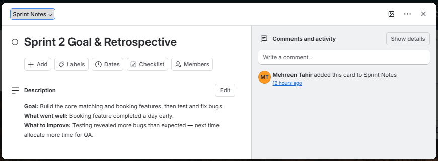

# 📚 StudyBuddy — Agile Sprint Planning & Project Management

---

## 🎯 Project Overview

**StudyBuddy** is a concept mobile app designed to help university students find study partners and book study rooms on campus.

This project simulates the role of a **Project Manager** planning and tracking the app's development using **Agile/Scrum methodology** — applying skills from the **Google Project Management Professional Certificate**. 🎓

---

## 🗂️ Trello Sprint Board

Organized into 5 lists: **📥 Backlog** → **🔨 Doing** → **✅ Done** → **🏁 Sprint 1 – To Do** → **📝 Sprint Notes**

---

## 📋 Product Backlog

| # | Task |
|---|------|
| 1 | 🎨 Design app logo and color scheme |
| 2 | 🖼️ Design login & signup screen UI |
| 3 | 🏠 Design home screen UI (search + booking) |
| 4 | 🗄️ Set up student database (user profiles) |
| 5 | 🔐 Build login & signup feature |
| 6 | 🤝 Build "Find Study Partner" matching feature |
| 7 | 📅 Build "Book a Study Room" calendar feature |
| 8 | 🔔 Set up push notifications for booking reminders |
| 9 | 📱 Test app on 3 sample Android devices |
| 10 | 🐛 Fix bugs found during testing |

---

## 🚀 Sprint 1

> **🎯 Goal:** Finish all UI designs and get login/signup working so users can create an account.

**Tasks:** Logo & color scheme · Login/signup UI · Home screen UI · Student database · Login/signup feature

| ✅ What went well | 🔧 What to improve |
|---|---|
| Designs finished on time | Login/signup took 2 extra days due to database setup delays |

---

## 🚀 Sprint 2

> **🎯 Goal:** Build the core matching and booking features, then test and fix bugs.

**Tasks:** Study Partner matching · Study Room booking · Push notifications · Android testing · Bug fixes

| ✅ What went well | 🔧 What to improve |
|---|---|
| Booking feature completed a day early | Testing revealed more bugs than expected — allocate more time for QA next time |

---

## 🛠️ Skills Demonstrated

- 🔄 Agile & Scrum methodology (sprint planning, backlog management, retrospectives)
- 📋 Product backlog creation and prioritization
- 📌 Task tracking and workflow management using Trello
- 🎯 Sprint goal setting and progress review
- 🎓 Applied project management principles from the **Google Project Management Professional Certificate**

---

Made with 📝 by <b>Mehreen Tahir</b>

